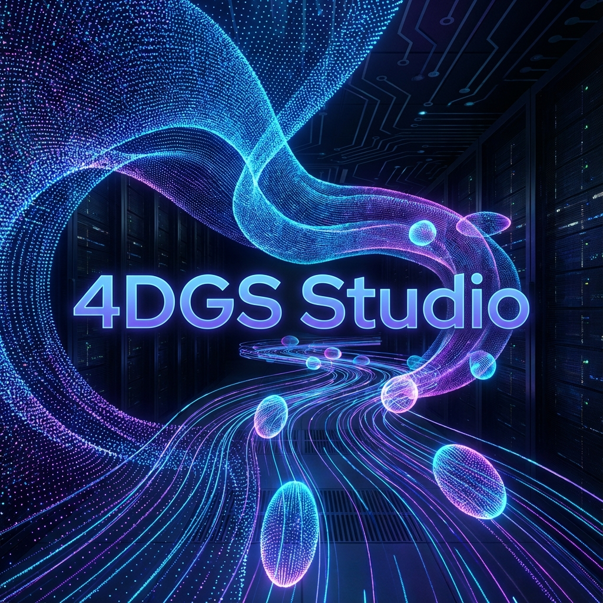
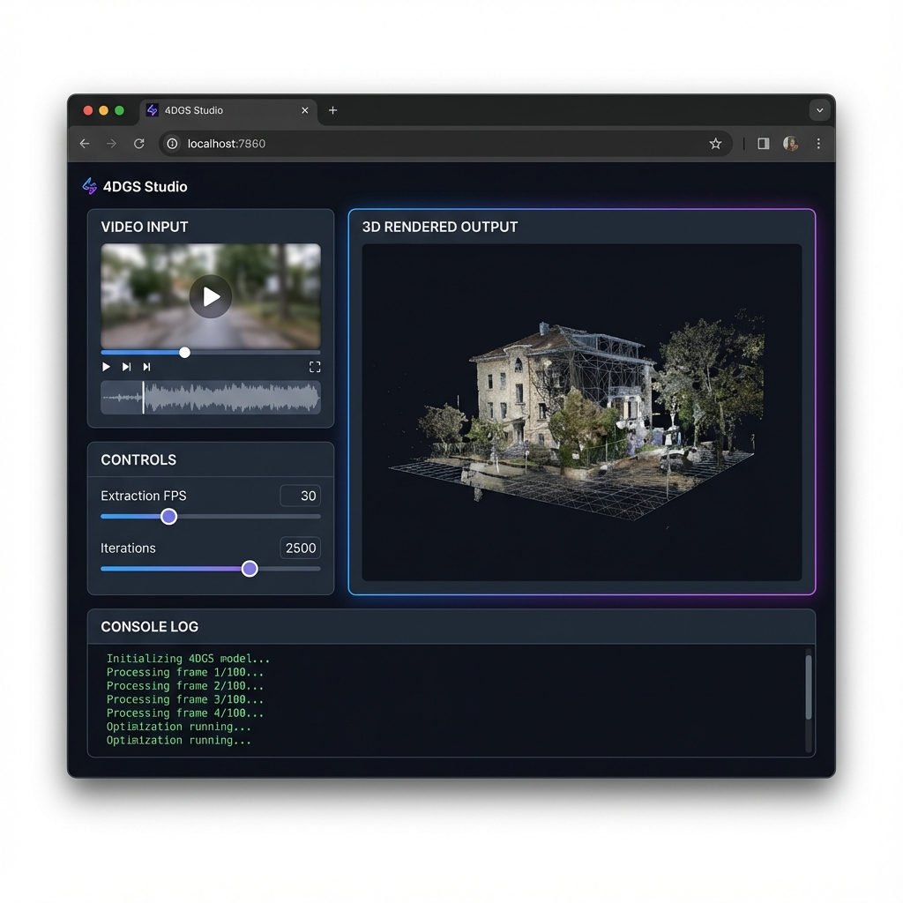

# ⚡ 4DGS Studio



> **"Turn Standard Videos into Living 4D Holograms."**


## 🌌 Project Overview
**4DGS Studio** is a unified graphical interface for **4D Gaussian Splatting**, enabling content creators to reconstruct dynamic 3D scenes from 2D video input. Unlike traditional photogrammetry which reconstructs static meshes, 4DGS models the **time dimension**, allowing for the capture of moving subjects, cloths, and facial expressions in full volumetric 3D.

| Phase | Status | Description |
| :--- | :--- | :--- |
| **Alpha** | ✅ Complete | Core engine integration and CLI testing. |
| **Beta (Current)** | 🚀 **Live** | Full GUI pipeline, simulation hooks, and subprocess isolation. |
| **Release Candidate** | ⏳ Coming Soon | Multi-GPU support, cloud export, and VR viewer integration. |

## 🖥️ Interface Preview

*The modern, dark-themed studio interface designed for seamless workflow.*

## 🚀 Key Features
- **End-to-End Pipeline**: From `.mp4` video input to 4D render in one click.
- **Interactive Studio UI**: Built with Gradio for intuitive parameter tuning and visualization.
- **Simulation/Mock Mode**: Test the pipeline flow instantly even without high-end drivers.
- **Real-Time Logs**: Live tracking of Frame Extraction, Structure-from-Motion (COLMAP), and Training.
- **Auto-Config**: Intelligent launchers (`launch_app.bat`) that auto-detect Visual Studio & CUDA paths.

## 🛠️ Installation & Usage

1. **Clone the Repository**
   ```bash
   git clone https://github.com/Santhoshnadella/4DGS.git
   cd 4DGS
   ```

2. **Run Dependency Helper** (Administrator)
   ```powershell
   powershell -ExecutionPolicy Bypass -File install_deps.ps1
   ```
   *Note: Manual installation of [CUDA Toolkit 11.8](https://developer.nvidia.com/cuda-11-8-0-download-archive) and [Visual Studio 2022 (C++)](https://visualstudio.microsoft.com/visual-cpp-build-tools/) is required for training.*

3. **Launch the Studio**
   Double-click `launch_app.bat`.
   Access web UI at: `http://127.0.0.1:7860`

## 📅 Roadmap
- [x] **Frame Extraction**: Automated via FFmpeg.
- [x] **Pose Estimation**: Integrated COLMAP support.
- [x] **GUI Wrapper**: Gradio-based control panel.
- [ ] **Viewer**: WebGL-based real-time 4D viewer (Coming Soon).
- [ ] **Cloud**: One-click deploy to Hugging Face Spaces (Coming Soon).

## 📄 License
This project is licensed under the **MIT License**.

---
*Built with ❤️ by Santhosh Nadella.*
